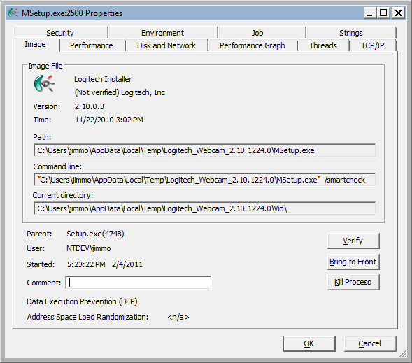

# Web Debugging Case 12: If You Allow It, They Will Depend On It

<div style="border:1px solid;background:#FFD050;color:black">
<b>NOTE:</b> This is #12 in a series of Web Debugging cases that I wrote while working on the Internet Explorer team at Microsoft. Circa February, 2011, this was Internet Explorer 9.0 timeframe. Originally written as a Word document, conversion to Markdown has neutered some of the fancier formatting.
</div>
<p>

This case covers a situation where a 3<sup>rd</sup> party installer was relying on a incidental memory behavior because it worked at the time and didn’t cause a problem or raise suspicions ...until IE9 came along and caused their dependency to fall apart.  Aka "A Regression"

I think insurance calls it something like Comparative Negligence or some fancy term like that :o)

In this case I'll go over digging into the content of a Setup program and using WinDBG to get a better idea of what is going on.

**Tools / Techniques used:**

- [WinDBG](http://www.microsoft.com/whdc/devtools/debugging/default.mspx) -- to set a breakpoint and watch memory
- Spy++ ([Spyxx](http://msdn.microsoft.com/en-us/library/aa242713(VS.60).aspx)) -- to determine/confirm app is hosting trident
- [ProcExp](http://technet.microsoft.com/en-us/sysinternals/bb896653.aspx) -- find extracted setup files (including all the content files)
- Text Editor -- Content inspection.

# Issue Details:

The repro steps for this bug were pretty simple:

- Download and run Logitech's Web Cam Software installer.

When you do that, you end up getting the following:


Hmm...that's weird.


I sure don't recognize that language. It's just a repeating sequence of "1234567890", which reeks of an initialization problem since it's not exactly garbage or garbled text.

Expanding that dropdown list you see it's an epidemic:


And not what you should be seeing...


Since the act of installing IE9 causes this, we point our investigation towards figuring out what the relationship is.

It's a pretty safe bet that the main client area of that app is a
trident window, but to make sure, we can use
[Spy++](http://msdn.microsoft.com/en-us/library/aa242713(VS.60).aspx) to
get a more definitive answer.

Launching Spy++ you get a hierarchy of all the windows on the system. Clicking on the **Find Windows** icon, you get a pop-up with a little target icon:


If you click and drag that target Icon  onto/into the client area of the setup program and release:


Spy++ will show you the Class name of that window:


This confirms what we could easily guess in the first place, but for some apps it's not that obvious which window is actually hosting trident, so using Spy++ is a good way to dig in.

Now we want to see where the content is coming from. In the previous web debugging case `Web Debugging Case 4: McAfee Blank Setup Window` the content was compiled into the Exe as a bunch of resources, and in that case we dumped the resources to learn more about that issue.

Fortunately, this time all the content is extracted during the setup UnZipping and lives in a fairly logical directory structure:


This is actually a simplified version of the content and directory structure that I created for the "reduced repro", the full details about finding this content and what actually got extracted (and where), I describe in [Appendix A: Finding All The Setup Files.](#appendix-a-finding-all-the-setup-files)

Taking a logical guess, we look into the "**Logitech\\UI\\html**" directory and find:


**00_Welcome.html** looks like a good place to start, seeing as the page we're looking at says "**Welcome!**" :o)

It's a small file, just over 300 lines long, and it was easy to spot some really interesting script:
```javascript
var selObj = document.getElementById("langselect");
if (selObj == null)
    return;
// 1031:  IDC_LANGSELECT_COMBO
var hWnd = window.external.GetDlgItem(1031);
if (hWnd == null)
    return;
// 0x0146: CB_GETCOUNT
// 0x0147: CB_GETCURSEL
// 0x0148: CB_GETLBTEXT
// 0x0149: CB_GETLBTEXTLEN

// initialize the languge dropdown list: ask the windows language combo box for its strings
var numItems = window.external.SendMessage(hWnd, 0x0146, 0, 0);	
if (numItems == 0)
    return;
var langName = "1234567890123456789012345678901234567890123456789012345678901234567890"; // need a large enough buffer
for (i=0; i < numItems; i++)
{
    window.external.SendMessage(hWnd, 0x0148, i, langName);
    var elt = document.createElement("option");
    elt.text = langName;
    selObj.options.add(elt);
}

// Select current language
selObj.selectedIndex = window.external.SendMessage(hWnd, 0x0147, 0, 0);
```

We can immediately recognize where the funky language name is probably coming from.

What's with the...
>`// need a large enough buffer`

...comment?

This technique is often referred to as the "That ought to be enough" placer holder method...or at least that's what I call it.  And usually ends up breaking your heart somewhere down the line :o)

Something else interesting to note are the...
```javascript
 window.external.SendMessage
```
...calls.

The "**external**" property (object) hanging off of **window** is what content like this can use to work with the hosting app.  It's how the underlying app code can project itself into that context.

As defined by [MSDN](http://msdn.microsoft.com/en-us/library/ms535246(VS.85).aspx):

> ## external Object
>
> Allows access to an additional object model provided by host
> applications of the Windows Internet Explorer browser components.

From this we can deduce that `window.external.SendMessage` likely maps to User32 [SendMessage](http://msdn.microsoft.com/en-us/library/ms644950(VS.85).aspx) function.

Which means we have a chance at deciphering the following from the for loop:

```javascript
window.external.SendMessage(hWnd, [0x0148]{.mark}, i, langName);
```

Conveniently, the developers of this app included comments mapping that message number (see the 4 comment lines in the code above, specifically
```javascript
// 0x0148: CB_GETLBTEXT)
```

Based on what we see, we can now tell a story...
> They are expecting that call to **Get** the **Text** of the **ListBox** control specified by the **hWnd**, at index **i**, and the result should end up in the **langName** variable.

Earlier in the script we see:
```javascript
var hWnd = window.external.GetDlgItem(1031);
```

What's happening here is that they have an actual GDI Listbox instantiated somewhere in the app, populated by all the languages (which with a little digging, we find listed in a separate xml file found in the content pool).

This script is attempting to grab all the values from that GDI listbox to populate the select element:

```html
<select id="langselect" tabindex="2" class="styled" size="1" onchange='onSelectLang(this);'></select>
```

...which appears further down the page (notice in the for loop that they are creating `<option>` elements).

Considering that we end up with the initialized value of `"1234567890..."` for all the languages tells us that **langName** variable is probably not getting set as expected.

To confirm this, I put this alert...
```javascript
alert("Before:" + langName);
```
...before and this alert...
```javascript
alert("After:" + langName);
```
...after the **SendMessage** call (*actually, I used a variable to build a string and then alert'd that after the loop, so it wouldn't blast out a ton of alerts, but you get the idea*)

Running the exe with this modification to the **00_Welcome.html** file I confirmed that **langName** was not being modified by the **SendMessage** call, as the value for **langName** never changed.

Now what? 

Once you go in through the **external** object, you are inside their code which we do not have access to.

At this point, I was curious to see if the **SendMessage** call was doing the right thing, which to me meant:

> If it is NOT doing the right thing, it may indicate they are not correctly populating the GDI ListBox, and might be something in or near the XML they are reading.

OR
>If it IS doing the right thing, why doesn't **langName** get set to the expected values?

Enter in
[WinDBG](https://learn.microsoft.com/en-us/windows-hardware/drivers/debugger/debugger-download-tools)

> Edit: I've updated the old busted Windbg link for new link that goes to new and improved WinDbg Preview, which has a different UI more features than the WinDbg screensnips below will show

My plan is to set a breakpoint on **SendMessage** and see if it succeeds in setting the memory location of **langName** to some known language value.

Since I know that it's actually **MSetup.exe** that is being run, from a cmd window I start debugging with:

`C:\>start windbg MSetup.exe`

This starts WinDBG and breaks before the first instruction of **MSetup.exe**. This allows you to do various pre-execution things, like getting symbols fixed and loaded and setting breakpoints.

First thing was to fix the symbols (for published Windows like User32) and reload:
```
0:000> !symfix
0:000> !reload
Reloading current modules
......................................
```

Now I want to set the breakpoint on **SendMessage**.

You can use the "**x**" (Examine Symbols) command and use it to search for the symbol you want, if you are unsure of the full name:

```
0:000> x *!SendMessage*
76023303    iertutil!SendMessageW (struct HWND__ *, unsigned int, unsigned int, long)
760a663b    SHELL32!SendMessageWithoutHanging (struct HWND__ *, unsigned int, unsigned int, long, SMWOH, unsigned int)
76d93eeb    USER32!SendMessageCallbackA (struct HWND__ *, unsigned int, unsigned int, long, <function> *, unsigned long)
76d430a9    USER32!SendMessageTimeoutWorker (struct HWND__ *, unsigned int, unsigned int, long, unsigned int, unsigned int, unsigned long *, int)
76d4313e    USER32!SendMessageTimeoutW (struct HWND__ *, unsigned int, unsigned int, long, unsigned int, unsigned int, unsigned long *)
76d66e97    USER32!SendMessageTimeoutA (struct HWND__ *, unsigned int, unsigned int, long, unsigned int, unsigned int, unsigned long *)
76d47543    USER32!SendMessageWorker (struct tagWND *, unsigned int, unsigned int, long, int)
76d44dfc    USER32!SendMessageCallbackW (struct HWND__ *, unsigned int, unsigned int, long, <function> *, unsigned long)

vvvvvvvvvvvvvvvvvvvvvvvvvvvvvvvvvvvvvvvvvvvvvvvvvvvvvvvvv
76d4764c    USER32!SendMessageW (struct HWND__ *, unsigned int, unsigned int, long)
76d3cc28    USER32!SendMessageA (struct HWND__ *, unsigned int, unsigned int, long)
^^^^^^^^^^^^^^^^^^^^^^^^^^^^^^^^^^^^^^^^^^^^^^^^^^^^^^^^^^

76d447b2    USER32!SendMessageToUI (struct tagIMEUI *, unsigned int, unsigned int, long, int)
76eb5b85    LPK!SendMessageW = <no type information>
76eb5b90    LPK!SendMessageA = <no type information>
77037d35    kernel32!SendMessageW (struct HWND__ *, unsigned int, unsigned int, long)
77a55d2f    ntdll!SendMessageToWERService (struct _WERSVC_MSG *, struct _WERSVC_MSG *)
```

Which one?

Pretty sure we're living in the land of UNICODE, so **USER32!SendMessageW** makes sense.

Setting the breakpoint:
> 0:000> bp USER32!SendMessageW

Windows is a message heavy system, so just setting a breakpoint like that is likely to hit many times.

What I really want is to stop when it is called from:

```javascript
window.external.SendMessage(hWnd, 0x0148, i, langName);
```

...in other words, I want the breakpoint to only pop when the second param is **0x0148**

The BP (Breakpoint) command supports a fairly rich set of functionality, part of which is the support for checking register and address values and using that as part of a conditional break.

Now I just need to figure out what to check.

After I set that initial BP and hit "g" (go), it immediately popped. Right place, but wrong time.

```
Breakpoint 0 hit
eax=00110204 ebx=000f03a2 ecx=0012eb44 edx=77a264f4 esi=0025fef0 edi=76d4764c
eip=76d4764c esp=0012eb5c ebp=0012ebc4 iopl=0         nv up ei pl nz na po nc
cs=001b  ss=0023  ds=0023  es=0023  fs=003b  gs=0000             efl=00000202
USER32!SendMessageW:
76d4764c 8bff            mov     edi,edi
```

The UI for **MSetup.exe** hasn't even shown up yet, so I know this isn't the time, but I can still learn something here.

I want to figure out what to use in building up the breakpoint condition.

The following shows digging for the details:
```
0:000> kP1
ChildEBP RetAddr  
0012eb58 74a7ad46 USER32!SendMessageW(
            struct HWND__ * hwnd = 0x00110204, 
            unsigned int message = 0x55, 
            unsigned int wParam = 0xf03a2, 
            long lParam = 0n3) [d:\w7rtm\windows\core\ntuser\client\cltxt.h @ 757]

0:000> dd esp
0012eb5c  74a7ad46 00110204 00000055 000f03a2
0012eb6c  00000003 00000000 0025fef0 018a002e
0012eb7c  000a0ec5 5e010ea4 0000000d 0000000b
0012eb8c  00000002 00000002 00000000 00000005
0012eb9c  00000017 00000190 00000000 00000060
0012ebac  00000060 fffd0020 0020001f 27000000
0012ebbc  00000e00 8c82347b 0012ebe4 74a7afe9
0012ebcc  0025fef0 000f03a2 0012edb8 000f03a2

0:000> dd esp + 8
0012eb64  00000055 000f03a2 00000003 00000000
0012eb74  0025fef0 018a002e 000a0ec5 5e010ea4
0012eb84  0000000d 0000000b 00000002 00000002
0012eb94  00000000 00000005 00000017 00000190
0012eba4  00000000 00000060 00000060 fffd0020
0012ebb4  0020001f 27000000 00000e00 8c82347b
0012ebc4  0012ebe4 74a7afe9 0025fef0 000f03a2
0012ebd4  0012edb8 000f03a2 0025fef0 00000100
```

So from this, I can see that if I use the Stack pointer `esp + 8]` as part of my condition in the breakpoint, I can set it up to break when it's 0x0148.

```
0:000> bp USER32!SendMessageW ".if (poi(@esp+8) = 0x148) { } .else {gc}"
breakpoint 0 redefined
0:000> bl
 0 e 76d4764c     0001 (0001)  0:**** USER32!SendMessageW ".if (poi(@esp+8) = 0x148) { } .else {gc}"
```


**NOTE:** That **poi**(@esp+8) is used to check the value at the address of esp+8. Just using esp+8 would never match because we'd be comparing 0x148 with an address, so we use poi which is the "Pointer-sized data from specified address" operator. Check out the debugger documentation for more on available directives and operators for the condition.

With that set now, I hit "g" and we break at the right spot AND at the right time:
```
eax=0015040c ebx=0012e430 ecx=00010000 edx=00000000 esi=00000148 edi=00000000
eip=76d4764c esp=0012e0b8 ebp=0012e378 iopl=0         nv up ei pl zr na pe nc
cs=001b  ss=0023  ds=0023  es=0023  fs=003b  gs=0000             efl=00000246
USER32!SendMessageW:
76d4764c 8bff            mov     edi,edi
0:000> kP1
ChildEBP RetAddr  
0012e0b4 004313ea USER32!SendMessageW(
            struct HWND__ * hwnd = 0x0015040c, 
            unsigned int message = 0x148, 
            unsigned int wParam = 0, 
            long lParam = 0n3575396) [d:\w7rtm\windows\core\ntuser\client\cltxt.h @ 757]

0:000> dd 0n3575396
00368e64  00320031 00340033 00360035 00380037
00368e74  00300039 00320031 00340033 00360035
00368e84  00380037 00300039 00320031 00340033
00368e94  00360035 00380037 00300039 00320031
00368ea4  00340033 00360035 00380037 00300039
00368eb4  00320031 00340033 00360035 00380037
00368ec4  00300039 00320031 00340033 00360035
00368ed4  00380037 00300039 00320031 00340033

0:000> db 0n3575396
00368e64  31 00 32 00 33 00 34 00-35 00 36 00 37 00 38 00  1.2.3.4.5.6.7.8.
00368e74  39 00 30 00 31 00 32 00-33 00 34 00 35 00 36 00  9.0.1.2.3.4.5.6.
00368e84  37 00 38 00 39 00 30 00-31 00 32 00 33 00 34 00  7.8.9.0.1.2.3.4.
00368e94  35 00 36 00 37 00 38 00-39 00 30 00 31 00 32 00  5.6.7.8.9.0.1.2.
00368ea4  33 00 34 00 35 00 36 00-37 00 38 00 39 00 30 00  3.4.5.6.7.8.9.0.
00368eb4  31 00 32 00 33 00 34 00-35 00 36 00 37 00 38 00  1.2.3.4.5.6.7.8.
00368ec4  39 00 30 00 31 00 32 00-33 00 34 00 35 00 36 00  9.0.1.2.3.4.5.6.
00368ed4  37 00 38 00 39 00 30 00-31 00 32 00 33 00 34 00  7.8.9.0.1.2.3.4.
```

And digging into the value of **langName**, using **dd 0n3575396** shows something that vaguely looks like ASCII values, and using **db** (dump bytes and ASCII chars), we can see that it looks like the memory location for **langName**.

Great! We're now looking in the right spot.

And because we're broken just before **SendMessageW** is going to execute, we just need to simply step past this call (in WinDBG just hit F10 and Shift+F11 to step out of the call).

Once we're past the **SendMessageW** call, checking the memory location again:
```
0:000> db 0n3575396
00368e64  43 00 68 00 69 00 6e 00-65 00 73 00 65 00 20 00  C.h.i.n.e.s.e. .
00368e74  28 00 53 00 69 00 6d 00-70 00 6c 00 69 00 66 00  (.S.i.m.p.l.i.f.
00368e84  69 00 65 00 64 00 29 00-00 00 32 00 33 00 34 00  i.e.d.)...2.3.4.
00368e94  35 00 36 00 37 00 38 00-39 00 30 00 31 00 32 00  5.6.7.8.9.0.1.2.
00368ea4  33 00 34 00 35 00 36 00-37 00 38 00 39 00 30 00  3.4.5.6.7.8.9.0.
00368eb4  31 00 32 00 33 00 34 00-35 00 36 00 37 00 38 00  1.2.3.4.5.6.7.8.
00368ec4  39 00 30 00 31 00 32 00-33 00 34 00 35 00 36 00  9.0.1.2.3.4.5.6.
00368ed4  37 00 38 00 39 00 30 00-31 00 32 00 33 00 34 00  7.8.9.0.1.2.3.4.
```

That tells me the **SendMessageW** call worked, and it successfully retrieved the value from the GDI ListBox.

This also told me that it's probably something on our side that has changed behavior.

# Conclusion:

I updated the bug with this data, including the spew from the debugger session and assigned back to Development.

Their further investigation revealed that this worked in IE8, because the script engine retained that memory location for **langName** before, during and after the **SendMessage** call. But in IE9, the memory is only temporarily used (just for the duration of the call) and then freed after the call, which in effect leaves **langName** unmodified.

The bug was resolved external for communication with Logitech. It's a bit of a bummer for them, as this setup has likely shipped on a CD-ROM or two :o[

# Appendix A: Finding All the Setup Files:

When you go to the [URL for the actual install](http://www.logitech.com/en-us/support-downloads/downloads/webcams/devices/3056?section=downloads&bit=&osid=14), and select to download the Full Installer:


It attempts to download <http://www.logitech.com/pub/techsupport/quickcam/lws210_full.exe>

...you get the option to Save or Run. I usually always choose to Save. I feel that gives me a little more control.

Once it's downloaded, launching **lws210_full.exe** does a little extraction dance, prompting you to confirm you actually want to run the setup, and then finally gives you the "Welcome!" dialog you see at the beginning of this document.

But where are all the files?

There are a few ways to figure this out and in this case I'll use [Process Explorer](https://learn.microsoft.com/en-us/sysinternals/downloads/process-explorer) because it's quick and easy, but [ProcMon](https://learn.microsoft.com/en-us/sysinternals/downloads/procmon) is another option.

With the setup app running, we can easily find it in ProcExp's tree
view:


If it wasn't so obviously identified (seen here with the Logitech logo), you could also use ProcExp's "Find Window's Process" option,


...which is much like Spy++'s, in that you click, drag, and drop the target onto the window you want to find, and it will highlight the owning process it in ProcExp's list of processes.

Once located, double clicking on **MSetup.exe** will give you the ProcExp's properties page for that process:



Looking into the directory
`C:\Users\jim\AppData\Local\Temp\Logitech_Webcam_2.10.1224.0\...`


<table>
<tr>
<td></img></td>
<td>We see the actual layout of files and content is pretty expansive.

You can see they have various languages and other content that isn’t necessary for the actual repro.

I trimmed out all the unnecessary content and files, zipped it up and attached to the bug.

This made for a simpler, quicker repro.

If all the content was compiled in as resources, we’d be looking at using the same techniques as in `Web Debugging Case 4:  McAfee Blank Setup Window` to view the content.
</td>
</tr>
</table>

(c) 2023 Jim Moore