# Web Debugging Case 17: OLAP Connection Failure

<div style="border:1px solid;background:#FFD050;color:black">
<b>NOTE:</b> This is #17 in a series of Web Debugging cases that I wrote while working on the Internet Explorer (Web Platform) team at Microsoft. Circa January, 2018.  This was Win10 / inbox Microsoft Edge (pre-chromium based version), and walks through investigating an Edge bug exposed by the Garmin website.  Originally written as a Word document, conversion to Markdown has neutered some of the fancier formatting.
</div>
<p>

This case digs into a situation where the problem would only repro on
specific machines, and no obvious IE settings could explain it.

**Tools / Techniques used:**

-   [**F12 Developer
    Tools**](http://msdn.microsoft.com/en-us/library/gg589507(v=vs.85))
    -- Code debugging
-   [**Fiddler**](https://www.telerik.com/fiddler) -- Content inspection
-   [**Process
    Explorer**](https://learn.microsoft.com/en-us/sysinternals/downloads/process-explorer)
    -- Track down key binaries

This issue came to us as Windows 8 bug. When accessing a part of
the web app, it would sit for a bit and finally pop an error complaining
about being unable to load a selected report:

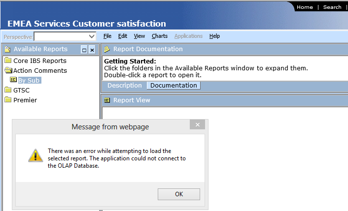

What you should have seen was:

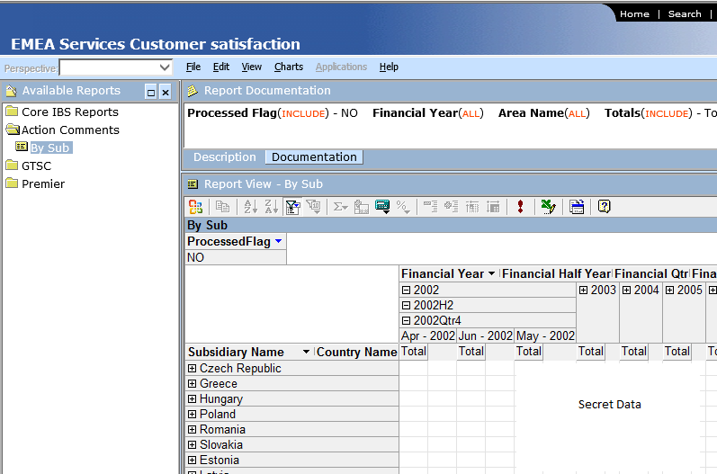

...not actually sure if that data is supposed to be secret, but I masked
it just in case :)

Looking at the text of the message again:
```
---------------------------
Message from webpage
---------------------------
There was an error while attempting to load the
selected report. The application could not connect to
the OLAP Database.
---------------------------
OK
---------------------------
```

"**load**" and "**connect**" make me think network issue. A quick check
of sessions in Fiddler shows something interesting:


"404 Not Found" for the full url:
[**http://DB3FITSVCUATSq2.partners.extranet.microsoft.com/msolap.asp**](http://DB3FITSVCUATSq2.partners.extranet.microsoft.com/msolap.asp)

On the machine that is **not** repro'ing the issue, this 404 doesn't show up, in fact there's no HTTP Request for that URL at all.

Since this is a **POST**, it may be interesting to see what it's attempting
to **POST**, so we look at it in its Raw form using Fiddler's Raw inspector:

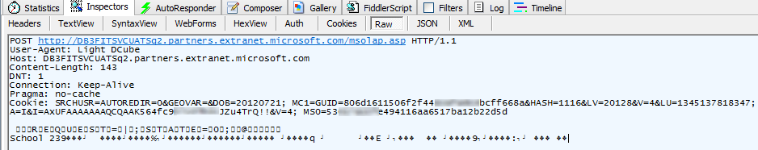

Check out the user agent value: "**Light DCube**". That's weird.

If you refer to the Fiddler session above, it shows it coming from
**iexplore:1688** (`<process>:<process id>`), so I would expect
something a little more familiar like: `Mozilla/4.0 (compatible; MSIE
7.0; Windows NT 6.2; WOW64; Trident/6.0; ...)`

This means that whatever code or component is sending that POST, it's
setting the header. A quick search of fiddler for "**Light DCube**":

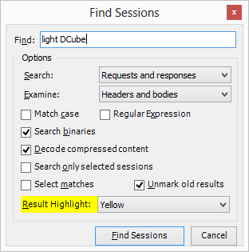

...came up with nothing (other than the session above). I was thinking
maybe there were other requests that might hold more clues. A similar
search on the working (not-repro'ing) machine came up completely empty.

What's the garbage in the POST body?


Looks like a mix of text and binary data. Fiddler's **HexView**
inspector is useful here:

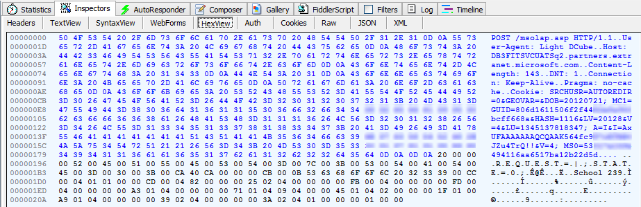

Well, maybe not that useful but it does show that we have some Unicode
chars (R.E.Q.U.E.S.T...) and standard ASCII chars ("School"), along with
some binary junk which could be anything.

What about the **DB3FITSVCUATSq2** server? A search in fiddler for that
string found it in a chunk of XML that defined a connection string,
where it was part of the Source:

**Source=DB3FITSVCUATSq2.partners.extranet.microsoft.com**

Interesting but just more data at this point.

Going back to that error:

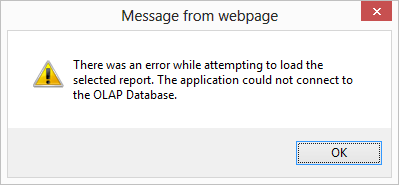

It's coming from the page, so something failed which means we can dig in
using F12 and [starting script
debugging](http://msdn.microsoft.com/en-us/library/gg699336(v=vs.85)).

There are no script errors in the script console, so let's at least see
where that message is being popped from.

A simple trick here, with the alert box still up, hit the Break All
(Ctrl + Shift + B) button:

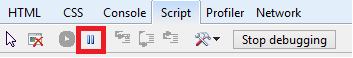

...and then hit the OK button of the alert dialog, and you will be
returned to the script that launched the alert:

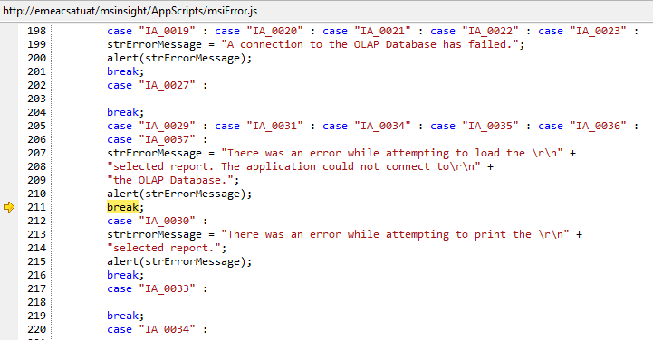

Interesting! We can see the text of that dialog here (which also means
we could have just done a quick search of the content using Fiddler or
Developer tools :) ).

To get a little better idea on the context of things, we can look at the
call stack:

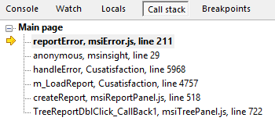

...the **handleError** function looks most interesting, so we'll look at
where it's called from, by double-clicking on the **m_LoadReport,
Cusatisfaction, line 4757** line. We do that, because **handleError** is
likely being called from code near to the actual failure, which is the
next function up in the stack.

After double-clicking, we are taken to a routine in an htc file:

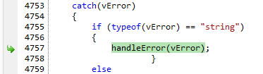

And dumping **vError** variable shows us:

```
>> vError 
"Error Connecting to the OLAP Server and Loading the Specified Report
msiInteractive.interactiveCreateOfficeReport
IA_0035
16389 - Not Found" 
```

That's interesting, but since this is in a **catch**, we'd rather see what
call caused this error to be thrown.

In this case, the routine was pretty long, but started with this:

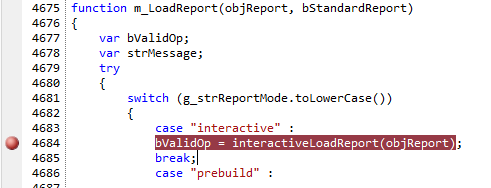

I put the breakpoint there because **g_strReportMode** was set to
"interactive", so it was at least going to make the call to the
**interactiveLoadReport()** function.

As I traced into this call (and a couple others that went deeper), I
came to this call:

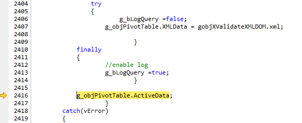

Actually not a call, but an access of the **ActiveData** property
hanging off whatever that **g_objPivotTable** object is. This was the
interesting bit of script, because stepping past this, fell into the
**catch(vError)** and looking at **vError** at that point showed:

```
>> vError.message
"Cannot connect to the server 'DB3FITSVCUATSq2.partners.extranet.microsoft.com'. The server is either not started or too busy."
```

Out of curiosity, I then dumped it via the Script Console:

```
>> g_objPivotTable.ActiveData
Cannot connect to the server 'DB3FITSVCUATSq2.partners.extranet.microsoft.com'. The server is either not started or too busy. 
```

Same thing and I recognize that **DB3FITSVCUATSq2** part!

That's the server in the HTTP 404 we saw in the fiddler session earlier.

Now I'm curious about what the **g_objPivotTable** object is.

Adding it to the Watch tab, we can see it's an OBJECT:

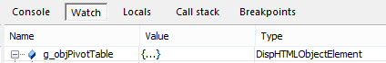

Which means we can get a glimpse of what it looks like in HTML by
dumping the **outerHTML** property:

```
>> g_objPivotTable.outerHTML 
"<OBJECT id=OfficePT style="DISPLAY: none" classid=clsid:0002E55A-0000-0000-C000-000000000046 NOEXTERNALDATA="true"><PARAM NAME="XMLData" VALUE="<xml ...[snipped a lot of goo]...</xml>"></OBJECT>" 
```

It was a much longer blob of XML goo inside the VALUE param (snipped for
readability here), but the interesting thing there is the clsid GUID: **0002E55A-0000-0000-C000-000000000046**

```
[Interesting to note]
Part of that XML was the Connection string:
<x:ConnectionString>Provider=MSOLAP.2;Data Source=http://DB3FITSVCUATSq2.partners.extranet.microsoft.com;Initial Catalog=dbibxglob_UAT;Client Cache Size=25;Auto Synch Period=10000;Cache Policy=6;Non Empty Threshold=1000000</x:ConnectionString>
```

This is a valid AX control (meaning it appears in the registry under HKEY_CLASSES_ROOT\Wow6432Node\CLSID hive), otherwise things would have failed way earlier on and likely would have shown up as "undefined" in the Watch
window.

To get a closer look at what this is, we look at that GUID in the
registry:

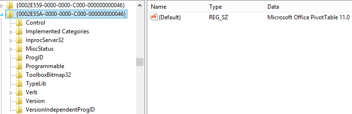

The (Default) key value says it's the "Microsoft Office PivotTable 11.0"

Another way to get at this data is to dump it using the **reg query**
command:

```
C:\>reg query HKEY_CLASSES_ROOT\Wow6432Node\CLSID\{0002E55A-0000-0000-C000-000000000046} /s

HKEY_CLASSES_ROOT\Wow6432Node\CLSID\{0002E55A-0000-0000-C000-000000000046}
    (Default)    REG_SZ    Microsoft Office PivotTable 11.0
HKEY_CLASSES_ROOT\Wow6432Node\CLSID\{0002E55A-0000-0000-C000-000000000046}\InprocServer32
    Assembly    REG_SZ    Microsoft.Office.Interop.Owc11, Version=11.0.0.0, Culture=neutral, PublicKeyToken=71E9BCE111E9
429C
    Class    REG_SZ    Microsoft.Office.Interop.Owc11.PivotTableClass
    RuntimeVersion    REG_SZ    v1.1.4322
    (Default)    REG_SZ    C:\PROGRA~2\COMMON~1\MICROS~1\WEBCOM~1\11\OWC11.DLL
    ThreadingModel    REG_SZ    Apartment
```

I trimmed out some of other details as the interesting part is the path
to the binary, which is what gets loaded into the IE process, when the OBJECT tag is parsed.

Notice that it's the old 8.3 style of path:
`C:\PROGRA\~2\COMMON\~1\MICROS\~1\WEBCOM\~1\11\OWC11.DLL`

OWC11 is Office 2003 timeframe, and the installer is still stuck in the
90's. 

Even tody (circa 2023) You can still change directory **cd** to that path as shown and
**dir /x** will still give you the 8.3 (shortened) version of any long
name path.

Also note the **wow6432node** part of the registry key. On a 64-bit
machine, 32-bit controls will usually get registered (automatically)
under this node, and as far as I can tell, there was only 32bit version.

But are we really any closer to figuring out what's going on? What do we
know so far?

1. Page is using OWC11 controls

1. In the repro case, we're getting an HTTP 404 to the
    **DB3FITSVCUATSq2**, which is nowhere to be found in the list of
    sessions for the working machine

1. **DB3FITSVCUATSq2** is part of the server specified a source in a
    connection string.

Really it's not a lot to go on. I felt a bit stuck.

But when I'm looking at 2 machines with essentially the same config
(Win8 + IE10, same account for website, etc.) where one repros and the
other doesn't, it becomes an exercise in figuring out where they do
differ because there's something different.

Here's where a bit of luck came in. I happen to have ProcExp running
(well, not just 'happen to have', I have ProcExp running just about all
the time...doesn't everyone? :) )

So I figured I'd see what was loaded, and maybe I had a different
versions of OWC components or something.

In ProcExp, you can enable a lower pane that displays Handles or DLLs:

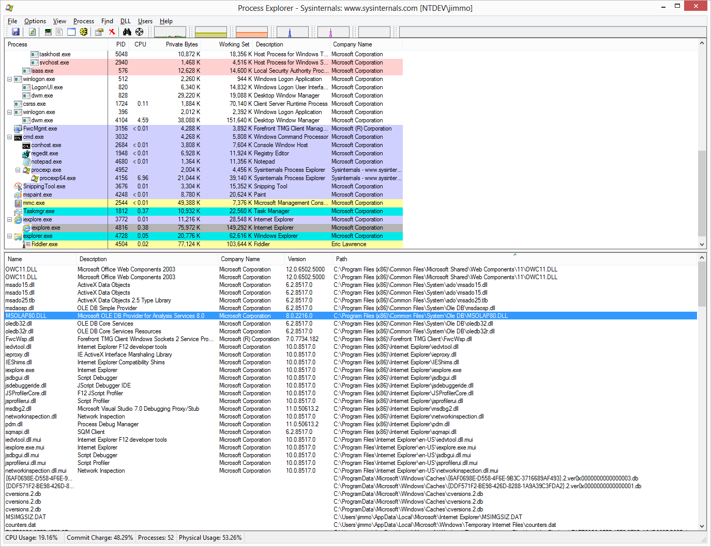

I sorted by Path, to find the OWC11.dll binary, and noticed something
that rung a bell:

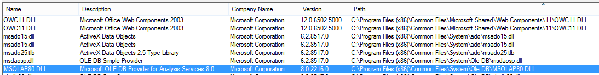

Specifically, `C:\Program Files (x86)\Common Files\System\Ole
DB\MSOLAP80.DLL`

"OLAP" (Online Analytical Processing). That's what's showing up in the
errors we've been seeing. This was on the repro machine, so I looked at
the non-repro machine and was surprised at first, because I didn't see
**MSOLAP80.DLL** listed...but that's because it's not there...

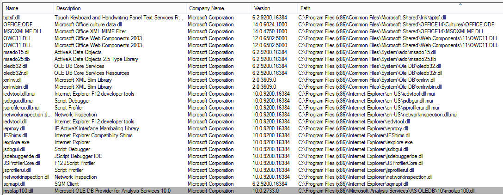

But **MSOLAP100.dll** is there. Is that the big clue?

I also noticed something significant here. These files are located in
different locations.

**On Repro Machine**: `C:\Program Files (x86)\Common Files\System\Ole
DB\MSOLAP80.DLL`

**On Non-Reproing Machine**: `C:\Program Files (x86)\Microsoft Analysis Services\AS OLEDB\10\msolap100.dll`

Both have a description "**Microsoft OLE DB Provider for Analysis
Services**", with what appear to be 2 very different versions.

# Conclusion:

At this point, I emailed the OBO (Original Bug Opener) and asked if they
had the **Microsoft Analysis Services** installed on the repro machine?

They replied that they did... **crushed** ...but, they said they
re-installed and things started working.

Hmm...well, I actually can't explain that. Maybe some details weren't
exactly clear or their install was haunted, I don't know. But the key
was that their site apparently needed a working install of Microsoft
Analysis Services to be installed and once (re)installed, they were back
in business with more recent versions.

Bug was resolved and no platform change needed.
