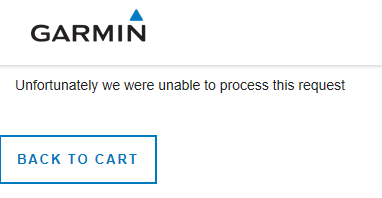

# Web Debugging Case 18: POST Bodies Missing Carriage Returns

<div style="border:1px solid;background:#FFD050;color:black">
<b>NOTE:</b> This is #18 in a series of Web Debugging cases that I wrote while working on the Internet Explorer (Web Platform) team at Microsoft. Circa January, 2018.  This was Win10 / inbox Microsoft Edge (pre-chromium based version), and walks through investigating an Edge bug exposed by the Garmin website.  Originally written as a Word document, conversion to Markdown has neutered some of the fancier formatting.
</div>
<p>

This case investigates why attempting to purchase an item on Garmin.com
would fail.

The [Part 1](#part-1-investigation-and-theory-confirmation) of this doc is the investigation that leads to a theory and confirmation of the root cause, using manual steps in Fiddler.

The [Part 2](#part-2-using-fiddler-to-tweak-post-body-contents) is using Fiddler Script to employ the theory so we can see it in action. In this case, tweak the body contents so Garmin gets what it expects (well formed data) and we get what we deserve (a working checkout process) 😊


# Part 1: Investigation and Theory Confirmation

The bug showed up during cart Checkout on Garmin's site. After adding an item to the cart and proceeding to checkout, the steps eventually lead you to this screen...


Clicking the **CONTINUE TO PAYMENT** button results in a very sparse and unhelpful error:



We expected something more like this:


Since this was working in Chrome, we can compare traffic in fiddler.

Watching the traffic in fiddler, I immediately saw a whole cascade of 404s that did not appear in Chrome's traffic:


I first thought this might be a significant clue, so I spent some time trying to figure out what was wrong with those requests.

Turns out, those files are all specified in a css.map file 
`https://static.garmincdn.com/com.garmin.guest-checkout/src-css/guest-checkout-v0.1.1.css.map`
```json
{"version":3,"sources":["../../src/sass/guest-checkout.scss","../../src/sass/_settings.scss","../../src/sass/settings/_project-setup.scss","../../src/sass/settings/_functions.scss","../../src/sass/settings/functions/_timing-functions.scss","../../src/sass/settings/_bootstrap-custom.scss","../../node_modules/bootstrap-sass/assets/stylesheets/bootstrap/mixins/_clearfix.scss","../../node_modules/bootstrap-sass/assets/stylesheets/bootstrap/_utilities.scss","../../node_modules/bootstrap-sass/assets/stylesheets/bootstrap/mixins/_center-block.scss","../../node_modules/bootstrap-sass/assets/stylesheets/bootstrap/mixins/
....
```
...and apparently are triggered when you are running Dev Tools. In this case, they are just noise...and a learning experience for me 😊

What to look at next? Let's compare what we get with Chrome vs. Edge.

By searching (Control+F) sessions in Fiddler for "unfortunately we were"
...


...we <i>are</i> actually fortunate in finding that string in a POST to
**https://pay.garmin.com/hpp/pay.shtml**


Comparing that with the Chrome reply:


...we can see it differs quite a bit in size (6,201 in Edge vs. 44,112 in Chrome).

Taking a quick peek at the failed session, this 'message' from the
server immediately pops out:
```html
<!-- error summary: Merchant signature was not valid!&lt;br /&gt;You can test the HMAC Calculation by submitting a payment request to https://ca-live.adyen.com/ca/ca/skin/checkhmac.shtml -->

<input type="hidden" name="merchantSig" value="I3HQWc2RU2vGlypXDvQKbNh8yklirvGj79J0XAysi/w=" />
<input type="hidden" name="skinCode" value="bQBGkKjl" />
```

Hmm... ok, they are saying something's wrong with the merchantSig? What's that? Merchant Signature? **<i>shrug</i>**

With the `/hpp/pay.shtml` session selected in Fiddler, let's compare Edge with Chrome, by looking in the inspectors tab, and viewing the HTTP Request in WebForms view:

**Edge:**


**Chrome:**


A little closer look...

```
  -------------------------------------------------------------------------
  **Edge**:     I3HQWc2RU2vGlypXDvQKbNh8yklirvGj79J0XAysi/w=
  ------------- -----------------------------------------------------------
  **Chrome**:   UdOppGHIS2vd7jlarQNsM8cIwOa0jYdgboTxcyI732Y=
  -------------------------------------------------------------------------
```
By golly, they are different!!! ...but not the root cause ☹

How did I figure that out not the root cause?

As I dug more into comparing the Edge to Chrome sessions by running the repro several times in each browser, I noticed that the sig changed just about every time for both browsers.

I needed to dig further. 

Continuing with the comparison approach, I  focused on the POST body:
```
+-----------------------------------------------------------------------+
| [Edge]                                                                |
|                                                                       |
| allowedMethods=card&billingAddress.city=REDMOND&billingAddress.c      |
| ountry=US&billingAddress.houseNumberOrName=1&billingAddress.postalCod |
| e=98052-8300&billingAddress.stateOrProvince=WA&billingAddress.street= |
| MICROSOFT+WAY&billingAddressType=2&brandCode=&countryCode=US&currency |
| Code=USD&deliveryAddress.city=REDMOND&deliveryAddress.country=US&deli |
| veryAddress.houseNumberOrName=1&deliveryAddress.postalCode=98052-8300 |
| &deliveryAddress.stateOrProvince=WA&deliveryAddress.street=MICROSOFT+ |
| WAY&deliveryAddressType=2&merchantAccount=GarminIntl&merchantReferenc |
| e=100029728754&orderData=H4sIAAAAAAAAAG3NvQrCMBQF4FcJmaUtDg4dq4sgWHR1 |
| SdK0vZA%2FbhOliO9ubAsW43rOdzhPOvTg%0AHJiuQskagUHzE%2BNS0ZJel4ZuKAel%2 |
| FppqLiJBeQf5SMVlyiNwbNTS%2BFTUc0FuoSi2O1IrJiQ5YyMx%0AroQ1LaBmHqxJp5Mi |
| %2B5X5Hh1Na5fw92lVfS4CYkwPVjMwUfXeu6HMcx7GrGOowWTCavp6AzFlWWss%0AAQAA |
| %0A&paymentAmount=0&recurringContract=RECURRING&resURL=https%3A%2F%2F |
| buy.garmin.com%2Fen-US%2FUS%2Fcheckout%2Fcheckout-client.ep&sessionVa |
| lidity=2018-01-23T07%3A42%3A21Z&shipBeforeDate=2018-01-23&shopperEmai |
| l=iecompat%40hotmail.com&shopperLocale=en_US&shopperReference=0ce6818 |
| 3-ab3f-4aa0-a434-9b04bec52db1&shopperStatement=100029728754&skinCode= |
| bQBGkKjl&merchantSig=I3HQWc2RU2vGlypXDvQKbNh8yklirvGj79J0XAysi%2Fw%3D |
+=======================================================================+
| [Chrome]                                                              |
|                                                                       |
| allow                                                                 |
| edMethods=card&billingAddress.city=REDMOND&billingAddress.country=US& |
| billingAddress.houseNumberOrName=1&billingAddress.postalCode=98052-83 |
| 00&billingAddress.stateOrProvince=WA&billingAddress.street=MICROSOFT+ |
| WAY&billingAddressType=2&brandCode=&countryCode=US&currencyCode=USD&d |
| eliveryAddress.city=REDMOND&deliveryAddress.country=US&deliveryAddres |
| s.houseNumberOrName=1&deliveryAddress.postalCode=98052-8300&deliveryA |
| ddress.stateOrProvince=WA&deliveryAddress.street=MICROSOFT+WAY&delive |
| ryAddressType=2&merchantAccount=GarminIntl&merchantReference=10002972 |
| 4928&orderData=H4sIAAAAAAAAAG3NvQrCMBQF4FcJmaUtDg4dq4sgWHR1SdK0vZA%2F |
| bhOliO9ubAsW43rOdzhPOvTg%0D%0AHJiuQskagUHzE%2BNS0ZJel4ZuKAel%2FppqLiJ |
| BeQf5SMVlyiNwbNTS%2BFTUc0FuoSi2O1IrJiQ5YyMx%0D%0AroQ1LaBmHqxJp5Mi%2B5 |
| X5Hh1Na5fw92lVfS4CYkwPVjMwUfXeu6HMcx7GrGOowWTCavp6AzFlWWss%0D%0AAQAA% |
| 0D%0A&paymentAmount=0&recurringContract=RECURRING&resURL=https%3A%2F% |
| 2Fbuy.garmin.com%2Fen-US%2FUS%2Fcheckout%2Fcheckout-client.ep&session |
| Validity=2018-01-23T06%3A36%3A29Z&shipBeforeDate=2018-01-23&shopperEm |
| ail=iecompat%40hotmail.com&shopperLocale=en_US&shopperReference=0ce68 |
| 183-ab3f-4aa0-a434-9b04bec52db1&shopperStatement=100029724928&skinCod |
| e=bQBGkKjl&merchantSig=UdOppGHIS2vd7jlarQNsM8cIwOa0jYdgboTxcyI732Y%3D |
+-----------------------------------------------------------------------+
```
See it? It's right there!! 😊

If I included all the copy/paste/windiff things I tried, this doc would be many more pages, so I'll skip right to the punchline.

Removing the non-essential stuff, and focusing on the **orderData** value:
```
+-----------------------------------------------------------------------+
| [Edge]                                                                |
|                                                                       |
| orderData=H4sIAAAAAAAAAG3NvQrCMBQF4FcJmaUtDg4dq4sgWHR1SdK0vZA%2FbhOli |
| O9ubAsW43rOdzhPOvTg%0AHJiuQskagUHzE%2BNS0ZJel4ZuKAel%2FppqLiJBeQf5SMV |
| lyiNwbNTS%2BFTUc0FuoSi2O1IrJiQ5YyMx%0AroQ1LaBmHqxJp5Mi%2B5X5Hh1Na5fw9 |
| 2lVfS4CYkwPVjMwUfXeu6HMcx7GrGOowWTCavp6AzFlWWss%0AAQAA%0A             |
+=======================================================================+
| [Chrome\]                                                             |
|                                                                       |
| orderData=H4sIAAAAAAAAAG3NvQrCMBQF4FcJmaUtDg4dq4sgWHR1SdK0vZA%2FbhOli |
| O9ubAsW43rOdzhPOvTg%0D%0AHJiuQskagUHzE%2BNS0ZJel4ZuKAel%2FppqLiJBeQf5 |
| SMVlyiNwbNTS%2BFTUc0FuoSi2O1IrJiQ5YyMx%0D%0AroQ1LaBmHqxJp5Mi%2B5X5Hh1 |
| Na5fw92lVfS4CYkwPVjMwUfXeu6HMcx7GrGOowWTCavp6AzFlWWss%0D%0AAQAA%0D%0A |
+-----------------------------------------------------------------------+
```
See it now? 😊

...I sure didn't, until I pasted both POST bodies as no-wrap, one-liners in an editor so I could eye-ball them and noticed that they were slightly different lengths, then traced back and found:

<table style="border:1px solid">
<tr>
<td>
<b>Edge</b>
<div style="font-family: monospace">
orderData=H4sIAAAAAAAAAG
 3NvQrCMBQF4FcJmaUtDg4dq4sgWHR1SdK0vZA%2FbhOliO9ubAsW43rOdzhPOvTg[<span style="color:black;background:yellow;font-weight:bold">%0A</span>]
 HJiuQskagUHzE%2BNS0ZJel4ZuKAel%2FppqLiJBeQf5SMVlyiNwbNTS%2BFTU
 c0FuoSi2O1IrJiQ5YyMx[<span style="color:'black';backgroundColor:'yellow'"><span style="color:black;background:yellow;font-weight:bold">%0A</span></span>]roQ1LaBmHqxJp5Mi%2B5X5Hh1Na5fw92lVfS4
 CYkwPVjMwUfXeu6HMcx7GrGOowWTCavp6AzFlWWss[<span style="color:black;background:yellow;font-weight:bold">%0A</span>]AQAA[<span style="color:black;background:yellow;font-weight:bold">%0A</span>]
 </div>
</td>
</tr>
<tr>
<td><b>Chrome</b>
<div style="font-family: monospace">

 orderData=H4sIAAAAAAAAAG3NvQrCMBQF4F
 cJmaUtDg4dq4sgWHR1SdK0vZA%2FbhOliO9ubAsW43rOdzhPOvTg[<span style="color:black;background:yellow;font-weight:bold">%0D%0A</span>]HJ
 iuQskagUHzE%2BNS0ZJel4ZuKAel%2FppqLiJBeQf5SMVlyiNwbNTS%2BFTUc0FuoSi2O
 1IrJiQ5YyMx[<span style="color:black;background:yellow;font-weight:bold">%0D%0A</span>]roQ1LaBmHqxJp5Mi%2B5X5Hh1Na5fw92lVfS4CYkwPV
 jMwUfXeu6HMcx7GrGOowWTCavp6AzFlWWss[<span style="color:black;background:yellow;font-weight:bold">%0D%0A</span>]AQAA[<span style="color:black;background:yellow;font-weight:bold">%0D%0A</span>]
</div>
</td>
</tr>
</table>

NOTE: Unfortunately, I tried to hack inline HTML to highlight all the `%0A` (Edge) and `%0D%0A` (in Chrome) occurrences, but github markdown view doesn't this type of futzing.  I'm trying to do too much with Markdown :o)

Here's a snip of what I was going for:


With everything else pretty much the same (at least in format), this seemed significant enough to dig into.

%0D == 13 == Carriage Return.

%0A == 10 == Line Feed.

In Edge, the POST HTML content has:
```html
<input type="hidden" name="orderData" value="H4sIAAAAAAAAAG3NvQrCMBQF4FcJmaUtDg4dq4sgWHR1SdK0vZA/bhOliO9ubAsW43rOdzhPOvTg
HJiuQskagUHzE+NS0ZJel4ZuKAel/ppqLiJBeQf5SMVlyiNwbNTS+FTUc0FuoSi2O1IrJiQ5YyMx
roQ1LaBmHqxJp5Mi+5X5Hh1Na5fw92lVfS4CYkwPVjMwUfXeu6HMcx7GrGOowWTCavp6AzFlWWss
AQAA" />
```

That \<input\> tag has a quoted string as its value, which does in fact include carriage returns.

If you are ever viewing content and need to see things on the byte level, Fiddler's HexView view is really handy for that.


<div style="border:1px solid;background:#FFD050;color:black">
<b>NOTE:</b> Note:  I’m skipping over some details about how the Garmin site uses a couple “302 Moved Temporarily” to load pages that automatically call Form.submit().  This results in some other sessions of interest appearing in captured taffic, but I’m not including here, to keep the story simpler.
</div>
<p>

Now we have a theory! What if I modified that POST body and re-added the 'missing' carriage returns?

Simple and quick way to do that is to drag that failed POST


...into the Composer tab in Fiddler:


Using an editor, I replaced all "%0A" with "%0D%0A" in the "Request Body" (lower portion in that screen cap). Pasted it back in and hit the Execute button.

This resulted in a successful POST:


and looking at it in Fiddler' Lo-Fi WebView:


We see it's the right content (this is what you see Fiddler webview with Chrome sessions as well).

At this point, we can say with some confidence that Edge has a bug in how it uses hidden inputs with carriage returns.

BUT!!! Wouldn't you like to see the tweak it in action? If so, read on...

# Part 2: Using Fiddler to Tweak POST Body Contents

Now that we know all it takes is adding in the missing carriage returns before the POST is sent will fix things, let's use Fiddler to do this automatically.

**What we'll do:**

- Add a "Fix Garmin Order" item to Fiddlers "Rules" menu.
  - This will allow toggling, so we can see repro vs. non-repro
- Add a conditional check in the **OnBeforeRequest** handler that checks the menu item state.
- Add a function that handles the 'tweaking' of the POST body, when the menu item is enabled.

All this will be done in the FiddlerScript tab.


...if you end up spending a lot of time editing Fiddler script, consider running Fiddler Script editor (installed with latest fiddler.) It has a bit nicer integration (features like Control+S to save, intellisense, Object Tree documentation, etc).

This Is what the menu item will look like (last item in the menu; Rules -> Repro Fixes -> Fix Garmin Order):


**To add that menu item:**

In the Handlers class, add a call to RulesOption (more info at [Telerik
docs](http://docs.telerik.com/fiddler/knowledgebase/fiddlerscript/customizemenus))
```csharp
class Handlers
{
   ...
   // Removes HTTP-caching related headers and specifies "no-cache" on requests and responses
    public static RulesOption("&Disable Caching", "Per&formance")
    var m_DisableCaching: boolean = true;

    public static RulesOption("Cache Always &Fresh", "Per&formance")
    var m_AlwaysFresh: boolean = false;

   // Repro fixes
    public static RulesOption("Fix Garmin Order", "Repro Fixes")
    var m_fFixGarminOrder: boolean = false;  
   ...
```
<i>(that "// Repro Fixes" section)</i>

If you save the script with no errors, it should immediately show up on
the Rules menu.

Next, add the function to do the tweaking. In this case, I just put the
function before the **onBeforeRequest** handler...
```csharp
static function reproFix_FixGarminOrder(oSession: Session) {
        
    var strBody = oSession.GetRequestBodyAsString();
        
    FiddlerApplication.Log.LogFormat("Body [BEFORE:{1}]:{0}",strBody, strBody.Length);
        
    strBody = Regex.Replace(strBody, "%0A","%0D%0A");

    // At first the replacement didn’t work, until I made sure to adjust the body length.
    // THis resulted in a lot of weird and misleading errors from Garmin.
    oSession.RequestHeaders["Content-Length"] = strBody.Length;
        
    FiddlerApplication.Log.LogFormat("Body [After.Final:{1}]:{0}",strBody, strBody.Length);
      
    oSession.requestBodyBytes = System.Text.Encoding.Default.GetBytes(stoSession.requestBodyBytes = System.Text.Encoding.Default.GetBytes(strBody
```

I left the **LogFormat** statements in there as examples, as these things usually take some trial & error 😊

With the menu and utility function in place, let's hook it up.

I opted for the quick and easy, just adding a check for the bool set by the menu, making sure to only apply it to the POST for URLs containing "`hpp/pay.shtml`"
```csharp
static function OnBeforeRequest(oSession: Session) {

    if (m_fFixGarminOrder && (oSession.url.indexOf("hpp/pay.shtml") > -1) && (oSession.HTTPMethodIs("POST")) ) {
        reproFix_FixGarminOrder(oSession);
    }     
...
```


Now, with the menu enabled, going through the checkout process to the point where you click the **CONTINUE TO PAYMENT** button, we get the right page displayed in Edge.


Lots more cool things you can do with Fiddler and scripting. Be sure to check out [Fiddler documentation](https://docs.telerik.com/fiddler/).

(c) 2023 Jim Moore